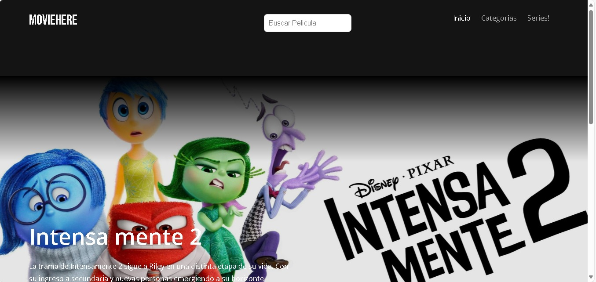
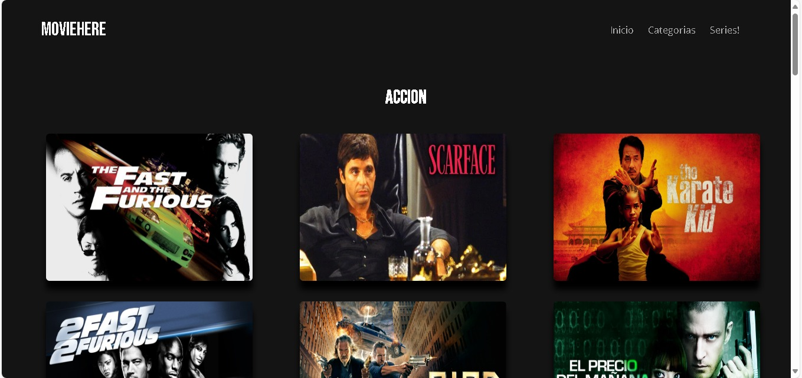

# 🎬 MovieHere

  
> **MovieHere** es mi primer proyecto de desarrollo de software, creado en 2023 durante mi primer año de estudios.  
> Es una página web **gratuita, sin anuncios y muy básica**, hecha principalmente con **HTML** y **CSS**, más una pizca de **JavaScript** para darle algo de interactividad.

---

## 🌟 Características

- 🎞️ Página web simple para explorar películas.  
- 🚫 100% libre de anuncios.  
- 🎨 Desarrollada con **HTML y CSS puro**.  
- ⚡ **JavaScript** para funcionalidades básicas.  
- 📱 Diseño inicial pensado solo para escritorio (prototipo básico).  

---

## 🖼️ Capturas de Pantalla

_Agrega aquí las imágenes de tu proyecto._  

Ejemplo:  

  
  

---

## 📂 Tecnologías utilizadas

- **HTML5** → Estructura de la página.  
- **CSS3** → Estilos, colores y diseño.  
- **JavaScript** → Funcionalidades básicas e interactividad.  

---

## 🚀 Cómo usarlo

1. Clona este repositorio:  
   ```bash
   git clone https://github.com/Gamer-Sm/moviehere.git

El proyecto no es funcional a la hora de ver peliculas ya que el server donde se almacenaron es de paga, y sale muy costoso espero poder tener los conocimientos para en un futuro hacerlo